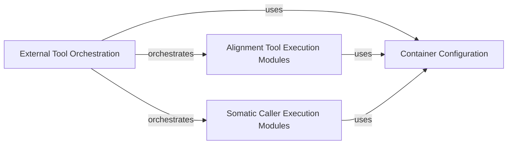

## Details

This subsystem is designed to automate the generation and execution of scripts for various external bioinformatics tools within containerized environments (Docker/Singularity). Its primary goal is to produce initial raw alignment (BAM) and variant (VCF) files by orchestrating a series of specialized tool executions.

### External Tool Orchestration

This is the central orchestrator of the External Tool Execution subsystem. It is responsible for generating and managing the execution scripts for both alignment and somatic variant calling pipelines. It initiates and oversees the workflows that leverage external bioinformatics tools within containerized environments, ultimately producing the raw alignment and variant files.

**Related Classes/Methods**:

- <a href="https://github.com/bioinform/somaticseq/somaticseq/utilities/dockered_pipelines/makeAlignmentScripts.py#L1-L1" target="_blank" rel="noopener noreferrer">`somaticseq/utilities/dockered_pipelines/makeAlignmentScripts.py` (1:1)</a>

- <a href="https://github.com/bioinform/somaticseq/somaticseq/utilities/dockered_pipelines/makeSomaticScripts.py#L1-L1" target="_blank" rel="noopener noreferrer">`somaticseq/utilities/dockered_pipelines/makeSomaticScripts.py` (1:1)</a>

- <a href="https://github.com/bioinform/somaticseq/somaticseq/utilities/dockered_pipelines/run_workflows.py#L1-L1" target="_blank" rel="noopener noreferrer">`somaticseq/utilities/dockered_pipelines/run_workflows.py` (1:1)</a>

### Alignment Tool Execution Modules

This component comprises a collection of specialized modules, each encapsulating the specific logic and commands required to run individual external bioinformatics tools for alignment-related tasks (e.g., BWA for alignment, Picard for duplicate marking, merging BAMs/Fastqs, trimming). These modules are invoked and managed by the External Tool Orchestration component to perform the alignment steps of the pipeline.

**Related Classes/Methods**:

- <a href="https://github.com/bioinform/somaticseq/somaticseq/utilities/dockered_pipelines/alignments/align.py#L1-L1" target="_blank" rel="noopener noreferrer">`somaticseq/utilities/dockered_pipelines/alignments/align.py` (1:1)</a>

- <a href="https://github.com/bioinform/somaticseq/somaticseq/utilities/dockered_pipelines/alignments/markdup.py#L1-L1" target="_blank" rel="noopener noreferrer">`somaticseq/utilities/dockered_pipelines/alignments/markdup.py` (1:1)</a>

- <a href="https://github.com/bioinform/somaticseq/somaticseq/utilities/dockered_pipelines/alignments/mergeBams.py#L1-L1" target="_blank" rel="noopener noreferrer">`somaticseq/utilities/dockered_pipelines/alignments/mergeBams.py` (1:1)</a>

- <a href="https://github.com/bioinform/somaticseq/somaticseq/utilities/dockered_pipelines/alignments/mergeFastqs.py#L1-L1" target="_blank" rel="noopener noreferrer">`somaticseq/utilities/dockered_pipelines/alignments/mergeFastqs.py` (1:1)</a>

- <a href="https://github.com/bioinform/somaticseq/somaticseq/utilities/dockered_pipelines/alignments/spreadFastq.py#L1-L1" target="_blank" rel="noopener noreferrer">`somaticseq/utilities/dockered_pipelines/alignments/spreadFastq.py` (1:1)</a>

- <a href="https://github.com/bioinform/somaticseq/somaticseq/utilities/dockered_pipelines/alignments/trim.py#L1-L1" target="_blank" rel="noopener noreferrer">`somaticseq/utilities/dockered_pipelines/alignments/trim.py` (1:1)</a>

### Somatic Caller Execution Modules

Similar to the alignment modules, this component consists of distinct modules, each dedicated to running a specific external somatic variant calling bioinformatics tool (e.g., MuTect2, VarDict, Strelka2, SomaticSniper). These modules contain the necessary commands and configurations for executing the callers within containerized environments, contributing to the generation of raw variant call files. They are orchestrated by the External Tool Orchestration component.

**Related Classes/Methods**:

- <a href="https://github.com/bioinform/somaticseq/somaticseq/utilities/dockered_pipelines/somatic_mutations/JointSNVMix2.py#L1-L1" target="_blank" rel="noopener noreferrer">`somaticseq/utilities/dockered_pipelines/somatic_mutations/JointSNVMix2.py` (1:1)</a>

- <a href="https://github.com/bioinform/somaticseq/somaticseq/utilities/dockered_pipelines/somatic_mutations/LoFreq.py#L1-L1" target="_blank" rel="noopener noreferrer">`somaticseq/utilities/dockered_pipelines/somatic_mutations/LoFreq.py` (1:1)</a>

- <a href="https://github.com/bioinform/somaticseq/somaticseq/utilities/dockered_pipelines/somatic_mutations/MuSE.py#L1-L1" target="_blank" rel="noopener noreferrer">`somaticseq/utilities/dockered_pipelines/somatic_mutations/MuSE.py` (1:1)</a>

- <a href="https://github.com/bioinform/somaticseq/somaticseq/utilities/dockered_pipelines/somatic_mutations/MuTect2.py#L1-L1" target="_blank" rel="noopener noreferrer">`somaticseq/utilities/dockered_pipelines/somatic_mutations/MuTect2.py` (1:1)</a>

- <a href="https://github.com/bioinform/somaticseq/somaticseq/utilities/dockered_pipelines/somatic_mutations/Scalpel.py#L1-L1" target="_blank" rel="noopener noreferrer">`somaticseq/utilities/dockered_pipelines/somatic_mutations/Scalpel.py` (1:1)</a>

- <a href="https://github.com/bioinform/somaticseq/somaticseq/utilities/dockered_pipelines/somatic_mutations/SomaticSniper.py#L1-L1" target="_blank" rel="noopener noreferrer">`somaticseq/utilities/dockered_pipelines/somatic_mutations/SomaticSniper.py` (1:1)</a>

- <a href="https://github.com/bioinform/somaticseq/somaticseq/utilities/dockered_pipelines/somatic_mutations/Strelka2.py#L1-L1" target="_blank" rel="noopener noreferrer">`somaticseq/utilities/dockered_pipelines/somatic_mutations/Strelka2.py` (1:1)</a>

- <a href="https://github.com/bioinform/somaticseq/somaticseq/utilities/dockered_pipelines/somatic_mutations/VarDict.py#L1-L1" target="_blank" rel="noopener noreferrer">`somaticseq/utilities/dockered_pipelines/somatic_mutations/VarDict.py` (1:1)</a>

- <a href="https://github.com/bioinform/somaticseq/somaticseq/utilities/dockered_pipelines/somatic_mutations/VarScan2.py#L1-L1" target="_blank" rel="noopener noreferrer">`somaticseq/utilities/dockered_pipelines/somatic_mutations/VarScan2.py` (1:1)</a>

### Container Configuration

This utility component provides common functionalities and options for managing the containerized environments (Docker/Singularity) in which the external bioinformatics tools are executed. It ensures consistency in how containers are utilized across different tool execution modules, abstracting away the complexities of container setup and execution parameters.

**Related Classes/Methods**:

- <a href="https://github.com/bioinform/somaticseq/somaticseq/utilities/dockered_pipelines/container_option.py#L1-L1" target="_blank" rel="noopener noreferrer">`somaticseq/utilities/dockered_pipelines/container_option.py` (1:1)</a>

### [FAQ](https://github.com/CodeBoarding/GeneratedOnBoardings/tree/main?tab=readme-ov-file#faq)