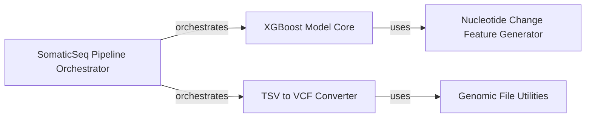

## Details

This subsystem embodies the core machine learning functionality of `somaticseq`, focusing on the classification of somatic variants using an XGBoost model and the subsequent conversion of results into the standard VCF format. It integrates several key components to achieve this, from feature engineering to final output generation.

### XGBoost Model Core

This component encapsulates the machine learning logic, specifically the training and prediction using the XGBoost algorithm. It takes feature-rich TSV data as input and outputs classification results, including prediction scores and feature importance. It is fundamental because it performs the actual machine learning classification, which is the primary purpose of this subsystem.

**Related Classes/Methods**:

- <a href="https://github.com/bioinform/somaticseq/somaticseq/somatic_xgboost.py#L1-L1" target="_blank" rel="noopener noreferrer">`somaticseq/somatic_xgboost.py` (1:1)</a>

### TSV to VCF Converter

Responsible for transforming the classified TSV output from the XGBoost Model Core into the standardized VCF format. It handles the parsing of TSV data, processing variant information, and formatting it into VCF-compliant fields, including quality scores and filtering details. This component is crucial as it translates the internal processing results into a widely accepted and usable genomic data format. It leverages general genomic file utilities for its operations.

**Related Classes/Methods**:

- <a href="https://github.com/bioinform/somaticseq/somaticseq/somatic_tsv2vcf.py#L1-L1" target="_blank" rel="noopener noreferrer">`somaticseq/somatic_tsv2vcf.py` (1:1)</a>

- <a href="https://github.com/bioinform/somaticseq/somaticseq/tsv2vcf.py#L1-L1" target="_blank" rel="noopener noreferrer">`somaticseq/tsv2vcf.py` (1:1)</a>

### Nucleotide Change Feature Generator

This component identifies and categorizes different types of nucleotide changes (e.g., single nucleotide variants (SNVs), insertions, deletions). This categorization is a crucial step in feature engineering, providing essential input features for the XGBoost Model Core to accurately classify somatic variants. It is fundamental because it prepares the data in a machine-learning-ready format, directly impacting the model's performance.

**Related Classes/Methods**:

- <a href="https://github.com/bioinform/somaticseq/somaticseq/ntchange_type.py#L1-L1" target="_blank" rel="noopener noreferrer">`somaticseq/ntchange_type.py` (1:1)</a>

### SomaticSeq Pipeline Orchestrator

This component serves as the high-level coordinator for the entire `somaticseq` pipeline. Within the context of the `Machine Learning & Output` subsystem, it orchestrates the sequential execution of the XGBoost Model Core for classification and the subsequent TSV to VCF Converter for output formatting. It is fundamental as it defines the overall workflow and ensures the correct execution order of the core machine learning and output generation steps.

**Related Classes/Methods**:

- <a href="https://github.com/bioinform/somaticseq/somaticseq/run_somaticseq.py#L1-L1" target="_blank" rel="noopener noreferrer">`somaticseq/run_somaticseq.py` (1:1)</a>

### Genomic File Utilities

General utility functions for parsing and handling genomic file formats.

**Related Classes/Methods**: _None_

### [FAQ](https://github.com/CodeBoarding/GeneratedOnBoardings/tree/main?tab=readme-ov-file#faq)