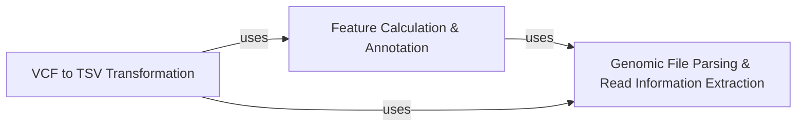

## Details

The `Variant Data Processing` component within `somaticseq` is a critical subsystem responsible for preparing genomic variant data for machine learning applications. It orchestrates the parsing of raw genomic files, the extraction of detailed read-level information, the calculation of comprehensive quantitative features, and the final transformation of data into a machine-learning-ready format.

### Genomic File Parsing & Read Information Extraction

This component serves as the initial gateway for all genomic data. It is responsible for parsing various genomic file formats (e.g., VCF, BAM, pileup) and extracting fundamental read-level information necessary for downstream feature calculation. It provides the basic utilities to read and interpret raw genomic data.

**Related Classes/Methods**:

- <a href="https://github.com/bioinform/somaticseq/somaticseq/genomic_file_parsers/genomic_file_handlers.py#L0-L0" target="_blank" rel="noopener noreferrer">`somaticseq.genomic_file_parsers.genomic_file_handlers` (0:0)</a>

- <a href="https://github.com/bioinform/somaticseq/somaticseq/genomic_file_parsers/read_info_extractor.py#L0-L0" target="_blank" rel="noopener noreferrer">`somaticseq.genomic_file_parsers.read_info_extractor` (0:0)</a>

- <a href="https://github.com/bioinform/somaticseq/somaticseq/genomic_file_parsers/pileup_reader.py#L0-L0" target="_blank" rel="noopener noreferrer">`somaticseq.genomic_file_parsers.pileup_reader` (0:0)</a>

- <a href="https://github.com/bioinform/somaticseq/somaticseq/genomic_file_parsers/pileup_reader.py#L163-L313" target="_blank" rel="noopener noreferrer">`somaticseq.genomic_file_parsers.pileup_reader:Base_calls` (163:313)</a>

- <a href="https://github.com/bioinform/somaticseq/somaticseq/genomic_file_parsers/pileup_reader.py#L13-L160" target="_blank" rel="noopener noreferrer">`somaticseq.genomic_file_parsers.pileup_reader:Pileup_line` (13:160)</a>

### Feature Calculation & Annotation

This component focuses on deriving quantitative features from genomic data. This includes calculating read-level metrics from BAM alignment files and integrating contextual information. It also handles the annotation of variants with these calculated features, which are crucial inputs for machine learning models.

**Related Classes/Methods**:

- <a href="https://github.com/bioinform/somaticseq/somaticseq/bam_features.py#L0-L0" target="_blank" rel="noopener noreferrer">`somaticseq.bam_features` (0:0)</a>

- <a href="https://github.com/bioinform/somaticseq/somaticseq/sequencing_features.py#L0-L0" target="_blank" rel="noopener noreferrer">`somaticseq.sequencing_features` (0:0)</a>

- <a href="https://github.com/bioinform/somaticseq/somaticseq/annotate_caller.py#L0-L0" target="_blank" rel="noopener noreferrer">`somaticseq.annotate_caller` (0:0)</a>

- <a href="https://github.com/bioinform/somaticseq/somaticseq/ntchange_type.py#L0-L0" target="_blank" rel="noopener noreferrer">`somaticseq.ntchange_type` (0:0)</a>

### VCF to TSV Transformation

This component is responsible for converting standardized VCF (Variant Call Format) files into a custom tab-separated value (TSV) format. During this transformation, it integrates the features calculated by the "Feature Calculation & Annotation" component, producing a comprehensive dataset ready for machine learning model training or prediction.

**Related Classes/Methods**:

- <a href="https://github.com/bioinform/somaticseq/somaticseq/somatic_vcf2tsv.py#L0-L0" target="_blank" rel="noopener noreferrer">`somaticseq.somatic_vcf2tsv` (0:0)</a>

- <a href="https://github.com/bioinform/somaticseq/somaticseq/single_sample_vcf2tsv.py#L0-L0" target="_blank" rel="noopener noreferrer">`somaticseq.single_sample_vcf2tsv` (0:0)</a>

### [FAQ](https://github.com/CodeBoarding/GeneratedOnBoardings/tree/main?tab=readme-ov-file#faq)