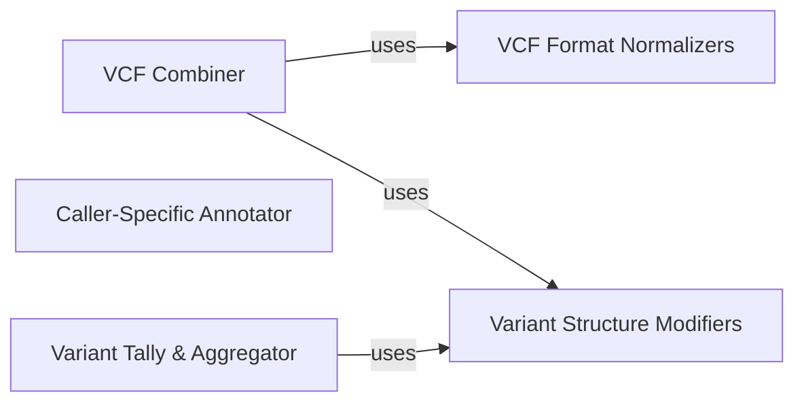

## Details

Abstract Components Overview

### VCF Combiner

This component acts as the orchestrator for integrating and standardizing VCF files originating from multiple variant callers. Its primary role is to merge these diverse VCFs and prepare them for subsequent processing steps, ensuring a consolidated view of variants across different calling algorithms. It directly calls modules responsible for VCF format normalization and structural modifications.

**Related Classes/Methods**:

- <a href="https://github.com/bioinform/somaticseq/somaticseq/combine_callers.py#L14-L256" target="_blank" rel="noopener noreferrer">`somaticseq.combine_callers.combineSingle` (14:256)</a>

### VCF Format Normalizers

This collection of modules is dedicated to converting and normalizing the specific VCF output formats from various variant callers (e.g., MuTect, VarScan2, VarDict, Strelka) into a standardized internal representation. This ensures consistency regardless of the original caller's output quirks. These modules are invoked by the `VCF Combiner`.

**Related Classes/Methods**:

- <a href="https://github.com/bioinform/somaticseq/somaticseq/vcf_modifier/modify_MuTect.py#L1-L1" target="_blank" rel="noopener noreferrer">`somaticseq.vcf_modifier.modify_MuTect` (1:1)</a>

- <a href="https://github.com/bioinform/somaticseq/somaticseq/vcf_modifier/modify_VarScan2.py#L1-L1" target="_blank" rel="noopener noreferrer">`somaticseq.vcf_modifier.modify_VarScan2` (1:1)</a>

- <a href="https://github.com/bioinform/somaticseq/somaticseq/vcf_modifier/modify_VarDict.py#L1-L1" target="_blank" rel="noopener noreferrer">`somaticseq.vcf_modifier.modify_VarDict` (1:1)</a>

- <a href="https://github.com/bioinform/somaticseq/somaticseq/vcf_modifier/modify_ssMuTect2.py#L1-L1" target="_blank" rel="noopener noreferrer">`somaticseq.vcf_modifier.modify_ssMuTect2` (1:1)</a>

- <a href="https://github.com/bioinform/somaticseq/somaticseq/vcf_modifier/modify_ssStrelka.py#L1-L1" target="_blank" rel="noopener noreferrer">`somaticseq.vcf_modifier.modify_ssStrelka` (1:1)</a>

### Variant Structure Modifiers

This component specializes in manipulating the structure of VCF entries. It handles the breakdown of complex variant representations (e.g., multi-allelic variants, block substitutions) into simpler, individual SNV (Single Nucleotide Variant) and Indel (Insertion/Deletion) records. Additionally, it provides utilities for VCF manipulation such as intersection with BED regions, sorting VCF entries, and identifying unique variant positions. These modules are directly utilized by the `VCF Combiner` and potentially other components for VCF processing.

**Related Classes/Methods**:

- <a href="https://github.com/bioinform/somaticseq/somaticseq/vcf_modifier/split_vcf.py#L1-L1" target="_blank" rel="noopener noreferrer">`somaticseq.vcf_modifier.split_vcf` (1:1)</a>

- <a href="https://github.com/bioinform/somaticseq/somaticseq/vcf_modifier/bed_util.py#L1-L1" target="_blank" rel="noopener noreferrer">`somaticseq.vcf_modifier.bed_util` (1:1)</a>

- <a href="https://github.com/bioinform/somaticseq/somaticseq/vcf_modifier/getUniqueVcfPositions.py#L1-L1" target="_blank" rel="noopener noreferrer">`somaticseq.vcf_modifier.getUniqueVcfPositions` (1:1)</a>

- <a href="https://github.com/bioinform/somaticseq/somaticseq/vcf_modifier/copy_TextFile.py#L1-L1" target="_blank" rel="noopener noreferrer">`somaticseq.vcf_modifier.copy_TextFile` (1:1)</a>

### Caller-Specific Annotator

This component is responsible for processing and enriching the output from individual somatic variant callers. It extracts specific metrics, flags, and information relevant to each caller's output, adding valuable context to the variant calls.

**Related Classes/Methods**:

- <a href="https://github.com/bioinform/somaticseq/somaticseq/annotate_caller.py#L1-L1" target="_blank" rel="noopener noreferrer">`somaticseq.annotate_caller` (1:1)</a>

### Variant Tally & Aggregator

This component performs detailed analysis, including tallying variants and calculating Variant Allele Frequencies (VAF) across multiple VCF files. It also facilitates the integration of external annotations, such as SNP effects and information from public databases like dbSNP and COSMIC.

**Related Classes/Methods**:

- <a href="https://github.com/bioinform/somaticseq/somaticseq/utilities/tally_variants_from_multiple_vcfs.py#L1-L1" target="_blank" rel="noopener noreferrer">`somaticseq.utilities.tally_variants_from_multiple_vcfs` (1:1)</a>

### [FAQ](https://github.com/CodeBoarding/GeneratedOnBoardings/tree/main?tab=readme-ov-file#faq)