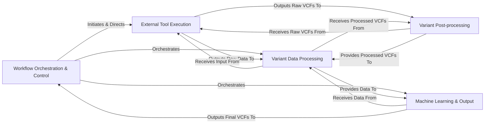

## Details

The `somaticseq` project is designed as a modular pipeline for somatic variant calling and classification. The architecture can be abstracted into five core components, each with distinct responsibilities and clear interactions, facilitating a robust and scalable workflow.

### Workflow Orchestration & Control

This component serves as the central command unit, managing the entire SomaticSeq pipeline's execution flow. It handles both single-sample and paired-sample modes, orchestrates parallel processing across genomic regions, and coordinates the sequential and parallel execution of all downstream components.

**Related Classes/Methods**:

- <a href="https://github.com/bioinform/somaticseq/somaticseq/run_somaticseq.py#L0-L0" target="_blank" rel="noopener noreferrer">`somaticseq.run_somaticseq` (0:0)</a>

- <a href="https://github.com/bioinform/somaticseq/somaticseq/somaticseq_parallel.py#L0-L0" target="_blank" rel="noopener noreferrer">`somaticseq.somaticseq_parallel` (0:0)</a>

- <a href="https://github.com/bioinform/somaticseq/somaticseq/utilities/split_bed_into_equal_regions.py#L0-L0" target="_blank" rel="noopener noreferrer">`somaticseq.utilities.split_bed_into_equal_regions` (0:0)</a>

### External Tool Execution [[Expand]](./External_Tool_Execution.md)

This component is responsible for generating and executing scripts that run various external bioinformatics tools (e.g., BWA for alignment, MuTect2, VarDict for somatic calling) within containerized environments (Docker/Singularity). It produces the initial raw alignment (BAM) and variant (VCF) files.

**Related Classes/Methods**:

- <a href="https://github.com/bioinform/somaticseq/somaticseq/utilities/dockered_pipelines/makeAlignmentScripts.py#L0-L0" target="_blank" rel="noopener noreferrer">`somaticseq.utilities.dockered_pipelines.makeAlignmentScripts` (0:0)</a>

- <a href="https://github.com/bioinform/somaticseq/somaticseq/utilities/dockered_pipelines/makeSomaticScripts.py#L0-L0" target="_blank" rel="noopener noreferrer">`somaticseq.utilities.dockered_pipelines.makeSomaticScripts` (0:0)</a>

- <a href="https://github.com/bioinform/somaticseq/somaticseq/utilities/dockered_pipelines/run_workflows.py#L48-L65" target="_blank" rel="noopener noreferrer">`somaticseq.utilities.dockered_pipelines.run_workflows` (48:65)</a>

### Variant Data Processing [[Expand]](./Variant_Data_Processing.md)

This component handles the intricate process of preparing variant data for machine learning. It includes parsing various genomic file formats, extracting detailed sequencing read-level information, calculating a comprehensive set of quantitative features from BAM alignment files and genomic context, and transforming VCF files into a feature-rich tab-separated value (TSV) format.

**Related Classes/Methods**:

- <a href="https://github.com/bioinform/somaticseq/somaticseq/genomic_file_parsers/genomic_file_handlers.py#L0-L0" target="_blank" rel="noopener noreferrer">`somaticseq.genomic_file_parsers.genomic_file_handlers` (0:0)</a>

- <a href="https://github.com/bioinform/somaticseq/somaticseq/genomic_file_parsers/read_info_extractor.py#L0-L0" target="_blank" rel="noopener noreferrer">`somaticseq.genomic_file_parsers.read_info_extractor` (0:0)</a>

- <a href="https://github.com/bioinform/somaticseq/somaticseq/bam_features.py#L0-L0" target="_blank" rel="noopener noreferrer">`somaticseq.bam_features` (0:0)</a>

- <a href="https://github.com/bioinform/somaticseq/somaticseq/sequencing_features.py#L0-L0" target="_blank" rel="noopener noreferrer">`somaticseq.sequencing_features` (0:0)</a>

- <a href="https://github.com/bioinform/somaticseq/somaticseq/somatic_vcf2tsv.py#L0-L0" target="_blank" rel="noopener noreferrer">`somaticseq.somatic_vcf2tsv` (0:0)</a>

- <a href="https://github.com/bioinform/somaticseq/somaticseq/single_sample_vcf2tsv.py#L0-L0" target="_blank" rel="noopener noreferrer">`somaticseq.single_sample_vcf2tsv` (0:0)</a>

### Machine Learning & Output [[Expand]](./Machine_Learning_Output.md)

This component embodies the core machine learning functionality. It implements the XGBoost model for both training (building) and predicting (classifying) somatic variants using the feature-rich TSV data. Subsequently, it converts the classified TSV results, including prediction scores and filtering information, back into the standard VCF format.

**Related Classes/Methods**:

- <a href="https://github.com/bioinform/somaticseq/somaticseq/somatic_xgboost.py#L0-L0" target="_blank" rel="noopener noreferrer">`somaticseq.somatic_xgboost` (0:0)</a>

- <a href="https://github.com/bioinform/somaticseq/somaticseq/somatic_tsv2vcf.py#L0-L0" target="_blank" rel="noopener noreferrer">`somaticseq.somatic_tsv2vcf` (0:0)</a>

- <a href="https://github.com/bioinform/somaticseq/somaticseq/tsv2vcf.py#L45-L627" target="_blank" rel="noopener noreferrer">`somaticseq.tsv2vcf` (45:627)</a>

### Variant Post-processing [[Expand]](./Variant_Post_processing.md)

This component is responsible for the initial processing, combining, and manipulation of VCF outputs generated by various external somatic variant callers. It standardizes their formats, annotates variants with caller-specific information, and provides utilities for VCF manipulation such as intersection with BED regions, splitting complex variants, sorting, and tallying variants from multiple VCFs.

**Related Classes/Methods**:

- <a href="https://github.com/bioinform/somaticseq/somaticseq/combine_callers.py#L0-L0" target="_blank" rel="noopener noreferrer">`somaticseq.combine_callers` (0:0)</a>

- <a href="https://github.com/bioinform/somaticseq/somaticseq/annotate_caller.py#L0-L0" target="_blank" rel="noopener noreferrer">`somaticseq.annotate_caller` (0:0)</a>

- <a href="https://github.com/bioinform/somaticseq/somaticseq/vcf_modifier/bed_util.py#L0-L0" target="_blank" rel="noopener noreferrer">`somaticseq.vcf_modifier.bed_util` (0:0)</a>

- <a href="https://github.com/bioinform/somaticseq/somaticseq/vcf_modifier/split_vcf.py#L0-L0" target="_blank" rel="noopener noreferrer">`somaticseq.vcf_modifier.split_vcf` (0:0)</a>

- <a href="https://github.com/bioinform/somaticseq/somaticseq/vcf_modifier/modify_MuTect2.py#L0-L0" target="_blank" rel="noopener noreferrer">`somaticseq.vcf_modifier.modify_MuTect2` (0:0)</a>

- <a href="https://github.com/bioinform/somaticseq/somaticseq/vcf_modifier/modify_VarDict.py#L0-L0" target="_blank" rel="noopener noreferrer">`somaticseq.vcf_modifier.modify_VarDict` (0:0)</a>

- <a href="https://github.com/bioinform/somaticseq/somaticseq/utilities/tally_variants_from_multiple_vcfs.py#L0-L0" target="_blank" rel="noopener noreferrer">`somaticseq.utilities.tally_variants_from_multiple_vcfs` (0:0)</a>

### [FAQ](https://github.com/CodeBoarding/GeneratedOnBoardings/tree/main?tab=readme-ov-file#faq)