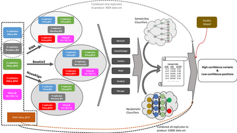
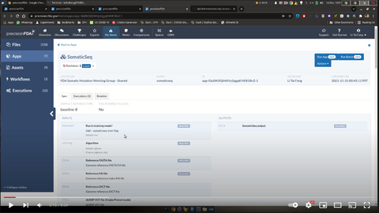

# SomaticSeq

SomaticSeq is an ensemble somatic SNV/indel caller that has the ability to use machine learning to filter out false positives from other callers. 
The detailed documentation is located in [docs/Manual.pdf](docs/Manual.pdf "User Manual"). 
* It was published in [Fang, L.T., Afshar, P.T., Chhibber, A. _et al_. An ensemble approach to accurately detect somatic mutations using SomaticSeq. _Genome Biol_ **16**, 197 (2015)](http://dx.doi.org/10.1186/s13059-015-0758-2 "Fang LT, et al. Genome Biol (2015)").
* Feel free to report issues and/or ask questions at the [Issues](../../issues "Issues") page.
* The [v2 branch](../../tree/v2) is still supported, but it's severely limited comparing to the current versions.

## Training data for benchmarking and/or model building

In 2021, the [FDA-led MAQC-IV/SEQC2 Consortium](https://www.fda.gov/science-research/bioinformatics-tools/microarraysequencing-quality-control-maqcseqc#MAQC_IV) has produced multi-center multi-platform whole-genome and whole-exome [sequencing data sets](https://identifiers.org/ncbi/insdc.sra:SRP162370) for a pair of tumor-normal reference samples (HCC1395 and HCC1395BL), along with the high-confidence [somatic mutation call set](https://ftp-trace.ncbi.nlm.nih.gov/ReferenceSamples/seqc/Somatic_Mutation_WG/release/latest/). This work was published in [Fang, L.T., Zhu, B., Zhao, Y. _et al_. Establishing community reference samples, data and call sets for benchmarking cancer mutation detection using whole-genome sequencing. _Nat Biotechnol_ **39**, 1151-1160 (2021)](https://doi.org/10.1038/s41587-021-00993-6 "Fang LT, et al. Nat Biotechnol (2021)") / [PMID:34504347](http://identifiers.org/pubmed:34504347 "Fang LT, et al. Nat Biotechnol (2021)") / [Free Read-Only Link](https://bit.ly/2021nbt "Fang LT, et al. Nat Biotechnol (2021)"). The following are some of the use cases for these resources:

* Use high-confidence call set as the "ground truth" to investigate how different sample preparations, sequencing library kits, and bioinformatic algorithms affect the accuracy of the somatic mutation pipelines, and develop best practices, e.g., [Xiao W. _et al_. Nat Biotechnol 2021](https://doi.org/10.1038/s41587-021-00994-5). 
* Use high-confidence call set as the "ground truth" to build accurate and robust machine learning models for somatic mutation detections, e.g., [Sahraeian S.M.E. _et al_. Genome Biol 2022](https://doi.org/10.1186/s13059-021-02592-9)

#### Click for [more details of the SEQC2's somatic mutation project](docs/seqc2.md).
#### [Recommendation](docs/train_for_classifiers.md) of how to use SEQC2 data to create SomaticSeq classifiers.

<hr>
<table style="width: 100%;">

  <tr>
    <td>Briefly explaining SomaticSeq v1.0</td>
    <td>SEQC2 somatic mutation reference data and call sets</td>
    <td>How to run <a href="https://precision.fda.gov/home/apps/app-G7XVKQQ02v051q5PK3yQYJKJ-1">SomaticSeq v3.6.3</a> on precisionFDA</td>

  </tr>
  
  <tr>
    <td><a href="https://youtu.be/MnJdTQWWN6w"></a></td>
    <td><a href="https://youtu.be/nn0BOAONRe8"></a></td>
    <td><a href="https://youtu.be/fLKokuMGTvk"></a></td>

  </tr>

  <tr>
    <td></td>
    <td></td>
    <td>Run in <a href="https://youtu.be/F6TSdg0OffM">train or prediction mode</a></td>

  </tr>

</table>
<hr>


# Installation

## Dependencies
This [dockerfile](Dockerfiles/somaticseq.base-1.4.dockerfile) reveals the dependencies
* Python 3, plus pysam, numpy, scipy, pandas, and xgboost libraries.
* [BEDTools](https://bedtools.readthedocs.io/en/latest/): required when parallel processing is invoked, and/or when any bed files are used as input files.
* Optional: dbSNP VCF file (if you want to use dbSNP membership as a feature).
* Optional: R and [ada](https://cran.r-project.org/package=ada) are required for AdaBoost, whereas XGBoost is implemented in python.
* To install SomaticSeq, clone this repo, `cd somaticseq`, and then run `pip install .` or `./setup.py install`.

## To install using pip
Make sure to install `bedtools` separately. 
```
pip install somaticseq
```

## To install the bioconda version
SomaticSeq can also be found on [](https://anaconda.org/bioconda/somaticseq). 
To [](http://bioconda.github.io/recipes/somaticseq/README.html), which also automatically installs a bunch of 3rd-party somatic mutation callers:
```
conda install -c bioconda somaticseq
```

## To install from github source with conda
```
conda create --name my_env -c bioconda python bedtools
conda activate my_env
git clone git@github.com:bioinform/somaticseq.git
cd somaticseq
pip install -e .
```

### Test your installation
There are some toy data sets and test scripts in [**example**](example) that should finish in <1 minute if installed properly.


## Run SomaticSeq with an example command
* At minimum, given the results of the individual mutation caller(s), SomaticSeq will extract sequencing features for the combined call set. Required inputs are 
  * `--output-directory` and `--genome-reference`, then
  * Either `paired` or `single` to invoke paired or single sample mode, 
    * if `paired`: `--tumor-bam-file`, and `--normal-bam-file` are both required.
    * if `single`: `--bam-file` is required. 
    
  Everything else is optional (though without a single VCF file from at least one caller, SomaticSeq does nothing).

* The following four files will be created into the output directory:
  * `Consensus.sSNV.vcf`, `Consensus.sINDEL.vcf`, `Ensemble.sSNV.tsv`, and `Ensemble.sINDEL.tsv`.

* If you're searching for pipelines to run those individual somatic mutation callers, feel free to take advantage of our [**Dockerized Somatic Mutation Workflow**](somaticseq/utilities/dockered_pipelines) as a start.
  * Important note: multi-argument options (e.g., `--extra-hyperparameters` or `--features-excluded`) cannot be placed immediately before `paired` or `single`, because those options would try to "grab" `paired` or `single` as an additional argument.

```
# Merge caller results and extract SomaticSeq features
somaticseq_parallel.py \
  --output-directory  $OUTPUT_DIR \
  --genome-reference  GRCh38.fa \
  --inclusion-region  genome.bed \
  --exclusion-region  blacklist.bed \
  --threads           24 \
paired \
  --tumor-bam-file    tumor.bam \
  --normal-bam-file   matched_normal.bam \
  --mutect2-vcf       MuTect2/variants.vcf \
  --varscan-snv       VarScan2/variants.snp.vcf \
  --varscan-indel     VarScan2/variants.indel.vcf \
  --jsm-vcf           JointSNVMix2/variants.snp.vcf \
  --somaticsniper-vcf SomaticSniper/variants.snp.vcf \
  --vardict-vcf       VarDict/variants.vcf \
  --muse-vcf          MuSE/variants.snp.vcf \
  --lofreq-snv        LoFreq/variants.snp.vcf \
  --lofreq-indel      LoFreq/variants.indel.vcf \
  --scalpel-vcf       Scalpel/variants.indel.vcf \
  --strelka-snv       Strelka/variants.snv.vcf \
  --strelka-indel     Strelka/variants.indel.vcf \
  --arbitrary-snvs    additional_snv_calls_1.vcf.gz additional_snv_calls_2.vcf.gz ... \
  --arbitrary-indels  additional_indel_calls_1.vcf.gz additional_indel_calls_2.vcf.gz ... 
```

* For all of those input VCF files, both `.vcf` and `.vcf.gz` are acceptable. SomaticSeq also accepts `.cram`, but some callers may only take `.bam`. 

* `--arbitrary-snvs` and `--arbitrary-indels` are added since v3.7.0. It allows users to input **any** arbitrary VCF file(s) from caller(s) that we did not explicitly incorporate. SNVs and indels have to be separated. 
  * If your caller puts SNVs and indels in the same output VCF file, you may split it using a SomaticSeq utility script, e.g., `splitVcf.py -infile small_variants.vcf -snv snvs.vcf -indel indels.vcf`. As usual, input can be either `.vcf` or `.vcf.gz`, but output will be `.vcf`. 
  * For those VCF file(s), any calls **not** labeled REJECT or LowQual will be considered a bona fide somatic mutation call. REJECT calls will be skipped. LowQual calls will be considered, but will not have a value of `1` in `if_Caller` machine learning feature. 
 
* `--inclusion-region` or `--exclusion-region` will require `bedtools` in your path.

* `--algorithm` defaults to `xgboost` as v3.6.0, but can also be `ada` (AdaBoost in R). XGBoost supports multi-threading and can be orders of magnitude faster than AdaBoost, and seems to be about the same in terms of accuracy, so we changed the default from `ada` to `xgboost` as v3.6.0 and that's what we recommend now.

* To split the job into multiple threads, place `--threads X` before the `paired` option to indicate X threads. It simply creates multiple BED file (each consisting of 1/X of total base pairs) for SomaticSeq to run on each of those sub-BED files in parallel. It then merges the results. This requires `bedtools` in your path.

Additional parameters to be specified **before** `paired` option to invoke training mode. In addition to the four files specified above, two classifiers (SNV and indel) will be created..
* `--somaticseq-train`: FLAG to invoke training mode with no argument, which also requires ground truth VCF files.
  * `--extra-hyperparameters`: add hyperparameters for xgboost, e.g., `--extra-hyperparameters scale_pos_weight:0.1 grow_policy:lossguide max_leaves:12`. 
* `--truth-snv`:        if you have a ground truth VCF file for SNV
* `--truth-indel`:      if you have a ground truth VCF file for INDEL

Additional input files to be specified **before** `paired` option invoke prediction mode (to use classifiers to score variants). Four additional files will be created, i.e., `SSeq.Classified.sSNV.vcf`, `SSeq.Classified.sSNV.tsv`,  `SSeq.Classified.sINDEL.vcf`, and `SSeq.Classified.sINDEL.tsv`.
* `--classifier-snv`:   classifier previously built for SNV
* `--classifier-indel`: classifier previously built for INDEL

Without those paramters above to invoking training or prediction mode, SomaticSeq will default to majority-vote consensus mode.


Do not worry if Python throws the following warning. This occurs when SciPy attempts a statistical test with empty data, e.g., z-scores between reference- and variant-supporting reads will be `nan` if there is no reference read at a position.

```
  RuntimeWarning: invalid value encountered in double_scalars
  z = (s - expected) / np.sqrt(n1*n2*(n1+n2+1)/12.0)
```


## To train for SomaticSeq classifiers with multiple data sets
Run `somatic_xgboost.py train --help` to see the options, e.g.,

```
somatic_xgboost.py train \
  -tsvs SAMPLE_1/Ensemble.sSNV.tsv SAMPLE_2/Ensemble.sSNV.tsv ... SAMPLE_N/Ensemble.sSNV.tsv \
  -out multiSample.SNV.classifier \
  -threads 8 -depth 12 -seed 42 -method hist -iter 250 \
  --extra-params scale_pos_weight:0.1 grow_policy:lossguide max_leaves:12
```

## Run SomaticSeq modules seperately
Most SomaticSeq modules can be run on their own. They may be useful in debugging context, or be run for your own purposes. See [this page](MODULES.md) for your options.


## Dockerized workflows and pipelines

### To run somatic mutation callers and then SomaticSeq
We have created a module (i.e., `makeSomaticScripts.py`) that can run all the dockerized somatic mutation callers and then SomaticSeq, described at [**somaticseq/utilities/dockered_pipelines**](somaticseq/utilities/dockered_pipelines). There is also an alignment workflow described there.
You need [docker](https://www.docker.com/) to run these workflows. Singularity is also supported, but is not optimized. Let me know if you find bugs. 


### To create training data to create SomaticSeq classifiers

* I recommend [SEQC2 Somatic Mutation Working Group](docs/seqc2.md)'s [reference sequencing data](https://identifiers.org/ncbi/insdc.sra:SRP162370) and [high-confidence somatic mutation call sets](https://ftp-trace.ncbi.nlm.nih.gov/ReferenceSamples/seqc/Somatic_Mutation_WG/release/latest/).

* Before well characterized real data was available, we have dockerized pipelines for *in silico* mutation spike in at [**somaticseq/utilities/dockered_pipelines/bamSimulator**](somaticseq/utilities/dockered_pipelines/bamSimulator).
These pipelines are based on [BAMSurgeon](https://github.com/adamewing/bamsurgeon). We have used it to create training set to build SomaticSeq classifiers, though it has not been updated for a while.

* Combine both BAMSurgeon *in silico* spike in and the real SEQC2 training data **may** give you better model than using either, which was shown in [Sahraeian S.M.E. _et al_. 2022](https://doi.org/10.1186/s13059-021-02592-9). The reason may be that the real data's high-confidence call sets do not have the most challenging genomic regions, whereas *in silico* data do not have the most realistic data characteristics. Combining both allows them to cover each other's shortcomings. 


### Dockerized alignment pipeline based on GATK's best practices
Described at [**somaticseq/utilities/dockered_pipelines**](somaticseq/utilities/dockered_pipelines). The module is `makeAlignmentScripts.py`.


### Utilities
We have some generally useful scripts in [utilities](somaticseq/utilities). Some of the more useful tools, e.g.,  

* `lociCounterWithLabels.py` finds overlapping regions among multiple bed files.
* `paired_end_bam2fastq.py` converts paired-end bam files into 1.fastq and 2.fastq files. It will not require an enormous amount of memory, nor will the resulting files crap out on downstream GATK tools.
* `run_workflows.py` is a rudimentary workflow manager that executes multiple scripts at once.
* `split_Bed_into_equal_regions.py` splits one bed file into a number of output bed files, where each output bed file will have the same total length.
