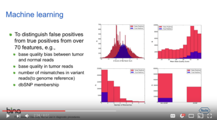

<b>SomaticSeq: An ensemble approach to accurately detect somatic mutations</b>
* Detailed documentation is included in the package. It's located in [docs/Manual.pdf](docs/Manual.pdf "User Manual").
* Open-access publication in [Genome Biology](http://dx.doi.org/10.1186/s13059-015-0758-2 "Fang LT, Afshar PT, Chhibber A, et al. An ensemble approach to accurately detect somatic mutations using SomaticSeq. Genome Biol. 2015;16:197.").
* Feel free to report issues and/or ask questions at the [Issues](../../issues "Issues") page.
* Note: Do not worry if Python throws the following warning. This occurs when scipy attempts a statistical test with empty data. This is expected when there is no variant read in the matched normal, resulting in NaN in the output.
   ```
     RuntimeWarning: invalid value encountered in double_scalars
     z = (s - expected) / np.sqrt(n1*n2*(n1+n2+1)/12.0)
   ```

<b>Dockers</b>
* We have created a docker repo for SomaticSeq: https://hub.docker.com/r/lethalfang/somaticseq/.
* Since v2.3.0, we have also included some run script generators for the dockerized somatic mutation callers that we have incorporated, 
for [single-thread jobs](utilities/dockered_pipelines/singleThread) (e.g., for targeted sequencing) and [multi-thread jobs](utilities/dockered_pipelines/multiThreads) (e.g., for whole genome sequencing).
The documentation for those scripts are in Section 4 of the [User's Manual](docs/Manual.pdf "Documentation").

<b>For a quick description of SomaticSeq, you may watch this 8-minute video:</b>
  [](https://www.youtube.com/watch?v=MnJdTQWWN6w "SomaticSeq Video")
