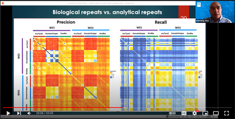

## Codes to generate figures for

[Xiao, W., Ren, L., Chen, Z. _et al_. Toward best practice in cancer mutation detection with whole-genome and whole-exome sequencing. _Nat Biotechnol_ **39**, 1141-1150 (2021)](https://doi.org/10.1038/s41587-021-00994-5 "Xiao W, et al. Nat Biotechnol (2021)") / [PMID:34504346](https://pubmed.ncbi.nlm.nih.gov/34504346/ "Xiao W, et al. Nat Biotechnol (2021)") / [SharedIt Link](https://rdcu.be/cxASG "Xiao W, et al. Nat Biotechnol (2021)").
  * A companion paper to establish the somatic mutation reference call set: [Fang, L.T., Zhu, B., Zhao, Y. _et al_. Establishing community reference samples, data and call sets for benchmarking cancer mutation detection using whole-genome sequencing. _Nat Biotechnol_ **39**, 1151-1160 (2021)](https://doi.org/10.1038/s41587-021-00993-6 "Fang LT, et al. Nat Biotechnol (2021)") / [PMID:34504347](https://pubmed.ncbi.nlm.nih.gov/34504347/ "Fang LT, et al. Nat Biotechnol (2021)") / [SharedIt Link](https://rdcu.be/cxs3D "Fang LT, et al. Nat Biotechnol (2021)").

## Video presentations of the two SEQC2 papers

<table style="text-align: center; width: 100%;">
  <tr>
    <td style="vertical-align: bottom; width: 50%;">Establishing somatic mutation reference call set for the SEQC2 cancer reference samples</td>
    <td style="vertical-align: bottom; width: 50%;">Towards best practice in cancer mutation detection with whole-genome and whole-exome sequencing</td>
  </tr>
  
  <tr>
    <td style="vertical-align: center; width: 50%;"></td>
    <td style="vertical-align: center; width: 50%;"></td>
  </tr>

</table>

