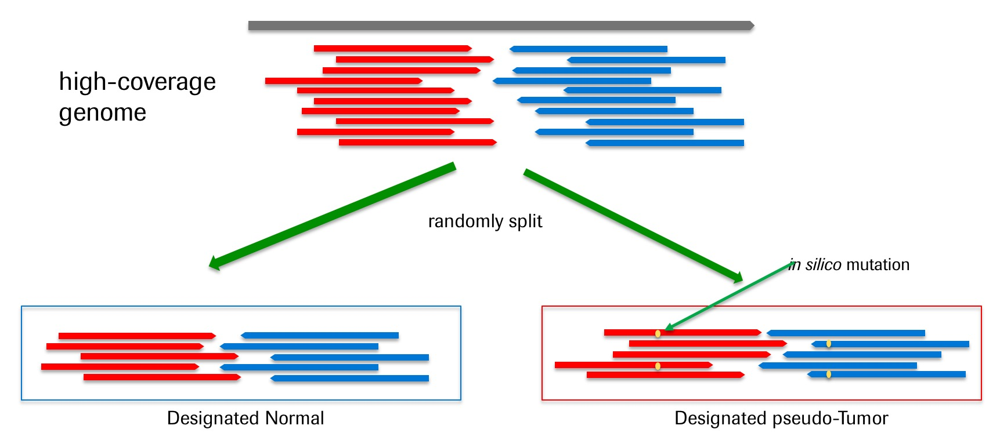

<b>Dockerized *in silico* somatic mutation spike in pipeline to generate training data set with ground truths</b>
* This pipeline is used to spike in *in silico* somatic mutations into existing BAM files in order to create a training set for somatic mutations.
* After the *in silico* data are generated, you can use the [somatic mutation pipeline](..) on the training data to generate the SomaticSeq classifiers.
* Classifiers built on training data work if the training data is similar to the data you want to predict. Ideally, the training data are sequenced on the same platform, same sample prep, and similar depth of coverage as the data of interest.
* This method is based on [BAMSurgeon](https://github.com/adamewing/bamsurgeon), slightly modified into [our own fork](https://github.com/ltfang-bina/bamsurgeon) for some speedups. 
* The proper citation for BAMSurgeon is [Ewing AD, Houlahan KE, Hu Y, et al. Combining tumor genome simulation with crowdsourcing to benchmark somatic single-nucleotide-variant detection. Nat Methods. 2015;12(7):623-30.](http://doi.org/10.1038/nmeth.3407)


**Requirement**
* Have internet connection, and able to pull and run docker images from Docker Hub, as we have dockerized the entire BAMSurgeon workflow. 
* **Recommended**: Have cluster management system with valid "qsub" command, such as Sun Grid Engine (SGE).

**1) An ideal example (single-thread) when you have sequencing replicates of the same samples**

In this case, *in silico* mutations will be spiked into Replicate_002.bam. Since Replicate_002.bam and Replicate_001.bam are otherwise the same sample, any mutations detected that you did not spike in are false positives. 

```
$PATH/TO/somaticseq/utilities/dockered_pipelines/bamSimulator/BamSimulator_singleThread.sh \
--genome-reference  /ABSOLUTE/PATH/TO/GRCh38.fa \
--tumor-bam-in      /ABSOLUTE/PATH/TO/Replicate_001.bam \
--normal-bam-in     /ABSOLUTE/PATH/TO/Replicate_002.bam \
--tumor-bam-out     syntheticTumor.bam \
--normal-bam-out    syntheticNormal.bam \
--split-proportion  0.5 \
--num-snvs          20000 \
--num-indels        8000 \
--min-vaf           0.0 \
--max-vaf           1.0 \
--left-beta         2 \
--right-beta        5 \
--min-variant-reads 2 \
--output-dir        /ABSOLUTE/PATH/TO/trainingSet \
--action            qsub
```

This is a workflow created using modified [BAMSurgeon](https://github.com/ltfang-bina/bamsurgeon).
* **BamSimulator_.sh** creates semi-simulated tumor-normal pairs out of your input tumor-normal pairs. The "ground truth" of the somatic mutations will be **synthetic_snvs.vcf**, **synthetic_indels.vcf**, and **synthetic_svs.vcf**.
* For multi-thread job (WGS), use BamSimulator_multiThreads.sh instead. See below for additional options and parameters.


**2) This example mimicks [DREAM Challenge](https://www.synapse.org/#!Synapse:syn312572/wiki/70726)**

In this case, a high-coverage BAM file is randomly split into two. One of which is designated normal, and the other one is designated tumor where mutations will be spiked in. Like the previous example, any mutations found between the designated tumor and designated normal are false positive, since not only are they from the same sample, but from the same sequencing run. This example will not capture false positives as a result of run-to-run biases if they exist in your sequencing data. It will, however, still capture artefacts related to sequencing errors, sampling errors, mapping errors, etc.  
```
$PATH/TO/somaticseq/utilities/dockered_pipelines/bamSimulator/BamSimulator_multiThreads.sh \
--genome-reference /ABSOLUTE/PATH/TO/GRCh38.fa --tumor-bam-in /ABSOLUTE/PATH/TO/highCoverageGenome.bam --tumor-bam-out syntheticTumor.bam --normal-bam-out syntheticNormal.bam --split-proportion  0.5 --num-snvs 10000 --num-indels 8000 --num-svs 1500 --min-vaf 0.0 --max-vaf 1.0 --left-beta 2 --right-beta 5 --min-variant-reads 2 --output-dir /ABSOLUTE/PATH/TO/trainingSet --threads 24 --action qsub --split-bam --indel-realign --merge-output-bams
```

**What does the command above do**

The ```--split-bem``` will randomly split the high coverage BAM file into two BAM files, one of which is designated normal and the other one designated tumor for mutation spike in.

<b>A schematic of the DREAM Challenge simulation procedure</b>
  


**3) Example Command for multi-thread jobs that merge and then split the input tumor and normal BAM files**

```
$PATH/TO/somaticseq/utilities/dockered_pipelines/bamSimulator/BamSimulator_multiThreads.sh \
--genome-reference /ABSOLUTE/PATH/TO/GRCh38.fa --tumor-bam-in /ABSOLUTE/PATH/TO/Tumor_Sample.bam --normal-bam-in /ABSOLUTE/PATH/TO/Normal_Sample.bam --tumor-bam-out syntheticTumor.bam --normal-bam-out    syntheticNormal.bam --split-proportion  0.5 --num-snvs 30000 --num-indels 10000 --num-svs 1500 --min-vaf 0.0 --max-vaf 1.0 --left-beta 2 --right-beta 5 --min-variant-reads 2 --output-dir /ABSOLUTE/PATH/TO/trainingSet --threads 24 --action qsub --merge-bam --split-bam --indel-realign --merge-output-bams
```

**What does that command do**

The ```--merge-bam``` will merge the normal and tumor BAM files into a single BAM file. Then, ```--split-bem``` will randomly split the merged BAM file into two BAM files.
One of which is designated normal, and one of which is designated tumor.
Synthetic mutations will then be spiked into the designated tumor to create "real" mutations.
This is the approach described in our [2017 AACR Abstract](http://dx.doi.org/10.1158/1538-7445.AM2017-386).

<b>A schematic of the simulation procedure (scenario #3 as described above)</b>
  


**The following parameters for the script:**
* ```--genome-reference``` /ABSOLUTE/PATH/TO/human_reference.fa (Required)
* ```--selector``` /ABSOLUTE/PATH/TO/capture_region.bed (BED file to limit where mutation spike in will be attempted)
* ```--tumor-bam-in``` Input BAM file (Required)
* ```--normal-bam-in``` Input BAM file (Optional, but required if you want to merge it with the tumor input)
* ```--tumor-bam-out``` Output BAM file for the designated tumor after BAMSurgeon mutation spike in
* ```--normal-bam-out``` Output BAM file for the designated normal if --split-bam is chosen
* ```--split-proportion``` The faction of total reads desginated to the normal. (Defaut = 0.5)
* ```--num-snvs``` Number of SNVs to spike into the designated tumor
* ```--num-indels``` Number of INDELs to spike into the designated tumor
* ```--num-svs``` Number of SVs to spike into the designated tumor (Default = 0)
* ```--min-depth``` Minimum depth where spike in can take place
* ```--max-depth``` Maximum depth where spike in can take place
* ```--min-vaf``` Minimum VAF to simulate
* ```--max-vaf``` Maximum VAF to simulate
* ```--left-beta``` Left beta of beta distribution for VAF
* ```--right-beta``` Right beta of beta distribution for VAF
* ```--min-variant-reads``` Minimum number of variant-supporting reads for a successful spike in
* ```--output-dir``` Output directory
* ```--merge-bam``` Flag to merge the tumor and normal bam file input
* ```--split-bam``` Flag to split BAM file for tumor and normal
* ```--clean-bam``` Flag to go through the BAM file and remove reads where more than 2 identical read names are present, or reads where its read length and CIGAR string do not match. This was necessary for some BAM files downloaded from TCGA. However, a proper pair-end BAM file should not have the same read name appearing more than twice. Use this only when necessary as it first sorts BAM file by qname, goes through the cleaning procedure, then re-sort by coordinates.
* ```--indel-realign``` Conduct GATK Joint Indel Realignment on the two output BAM files. Instead of syntheticNormal.bam and syntheticTumor.bam, the final BAM files will be **syntheticNormal.JointRealigned.bam** and **syntheticTumor.JointRealigned.bam**.
* ```--seed``` Random seed. Pick any integer for reproducibility purposes.
* ```--threads``` Split the BAM files evenly in N regions, then process each (pair) of sub-BAM files in parallel. 
* ```--action``` The command preceding the run script created into /ABSOLUTE/PATH/TO/BamSurgeoned_SAMPLES/logs. "qsub" is to submit the script in SGE system. Default = echo


**Recommendations for different scenario for --merge-bam / --split-bam / --indel-realign**
1) If you have sequenced replicate normal, that's pretty good data set for training. You can use one of the normal as normal, and designate the other normal (of the same sample) as tumor. Use ```--indel-realign``` only. You don't need to merge them.
2) When you have a normal that's roughly 2X the coverage as your data of choice, you can split that into two halves. One designated as normal, and the other one designated as tumor. That [DREAM Challenge's approach](https://www.synapse.org/#!Synapse:syn312572/wiki/62018). Use ```--split-bam --indel-realign```.
3) Another approach is to merge the tumor and normal data, and then randomly split them as described above. When you merge the tumor and normal, the real tumor mutations are relegated as germline or noise, so they are considered false positives, because they are supposed to be evenly split into the designated normal. To take this approach, use ```--merge-bam --split-bam --indel-realign```.
* Don't use --indel-realign if you do not use indel realignment in your alignment pipeline. 
* You can visualize the shape of VAF distribution with python command:
``` 
    import scipy.stats as stats
    import numpy as np
    import matplotlib.pyplot as plt

    leftBeta, rigthBeta = 2,5
    minAF, maxAF = 0,1
    x = np.linspace(0,1,101)
    y = stats.beta.pdf(x, leftBeta, rigthBeta, loc = minAF, scale = minAF + maxAF)
    _ = plt.plot(x, y)
```
* In some BAM files, there are reads where read lengths and CIGAR strings don't match. Spike in will fail in these cases, and you'll need to invoke ```--clean-bam``` to get rid of these problematic reads. 


**To create SomaticSeq classifiers**
* After the mutation simulation jobs are completed, you may create classifiers with the training data with the following command:
* See [our somatic mutation pipeline](..) for more details.
```
$PATH/TO/somaticseq/utilities/dockered_pipelines/submit_callers_multiThreads.sh \
--output-dir      /ABSOLUTE/PATH/TO/trainingSet/somaticMutationPipeline \
--normal-bam      /ABSOLUTE/PATH/TO/trainingSet/syntheticNormal.bam \
--tumor-bam       /ABSOLUTE/PATH/TO/trainingSet/syntheticTumor.bam \
--human-reference /ABSOLUTE/PATH/TO/GRCh38.fa \
--dbsnp           /ABSOLUTE/PATH/TO/dbSNP.GRCh38.vcf \
--thread          24 \
--truth-snv       /ABSOLUTE/PATH/TO/trainingSet/synthetic_snvs.vcf \
--truth-indel     /ABSOLUTE/PATH/TO/trainingSet/synthetic_indels.leftAlign.vcf \
--action          echo \
--mutect2 --somaticsniper --vardict --muse --lofreq --strelka --somaticseq
```
