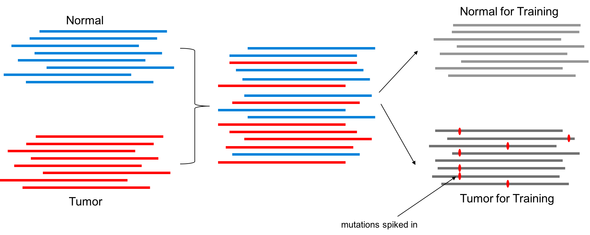

**Requirement**
* Have internet connection, and able to pull and run docker images from https://docker.io
* Cluster management system with valid "qsub" command

**Example Command**
```
$PATH/TO/somaticseq/utilities/dockered_pipelines/bamSurgeon/singleThread/BamSimulator.sh \
--genome-reference  /ABSOLUTE/PATH/TO/GRCh38.fa \
--selector          /ABSOLUTE/PATH/TO/Exome_Capture.GRCh38.bed \
--tumor-bam-in      /ABSOLUTE/PATH/TO/Tumor_Sample.bam \
--normal-bam-in     /ABSOLUTE/PATH/TO/normal_sample.bam \
--tumor-bam-out     syntheticTumor.bam \
--normal-bam-out    syntheticNormal.bam \
--split-proportion  0.5 \
--num-snvs          250 \
--num-indels        100 \
--num-svs           50 \
--min-vaf           0.05 \
--max-vaf           0.5 \
--min-variant-reads 2 \
--output-dir        /ABSOLUTE/PATH/TO/BamSurgeoned_SAMPLES \
--action            qsub
--merge-bam --split-bam
```

**BamSimulator.sh** creates two semi-simulated tumor-normal pairs out of your input tumor-normal pairs. The "ground truth" of the somatic mutations will be **synthetic_snvs.vcf**, **synthetic_indels.vcf**, and **synthetic_svs.vcf**.

The following options:
* --genome-reference /ABSOLUTE/PATH/TO/human_reference.fa (Required)
* --selector /ABSOLUTE/PATH/TO/capture_region.bed (Required)
* --tumor-bam-in Input BAM file (Required)
* --normal-bam-in Input BAM file (Optional, but required if you want to merge it with the tumor input)
* --tumor-bam-out Output BAM file for the designated tumor after BAMSurgeon mutation spike in
* --normal-bam-out Output BAM file for the designated normal if --split-bam is chosen
* --split-proportion The faction of total reads desginated to the normal. (Defaut = 0.5)
* --num-snvs Number of SNVs to spike into the designated tumor
* --num-indels Number of INDELs to spike into the designated tumor
* --num-svs Number of SVs to spike into the designated tumor
* --min-depth Minimum depth where spike in can take place
* --max-depth Maximum depth where spike in can take place
* --min-vaf Minimum VAF to simulate
* --max-vaf Maximum VAF to simulate
* --min-variant-reads Minimum number of variant-supporting reads for a successful spike in
* --output-dir Output directory
* --merge-bam Flag to merge the tumor and normal bam file input
* --split-bam Flag to split BAM file for tumor and normal
* --clean-bam Flag to go through the BAM file and remove reads where more than 2 identical read names are present. This was necessary for some BAM files downloaded from TCGA.
* --seed Random seed. Pick any integer. 
* --action The command preceding the run script created into /ABSOLUTE/PATH/TO/BamSurgeoned_SAMPLES/logs. "qsub" is to submit the script in SGE system. Default = echo

**What does that command do**

This is a workflow created using [BAMSurgeon](https://github.com/adamewing/bamsurgeon). The command demonstrated above will merge the normal and tumor BAM files into a single BAM file, and then randomly split the merged BAM file into two BAM files. One of which is designated normal, and one of which is designated tumor. Real somatic mutations in the original tumor will be randomly split into both files, and can be considered germline variants or tummor-normal contamiation. Synthetic mutations will then be spiked into the designated tumor to create "real" mutations.

<b>A schematic of the simulation procedure</b>
  
